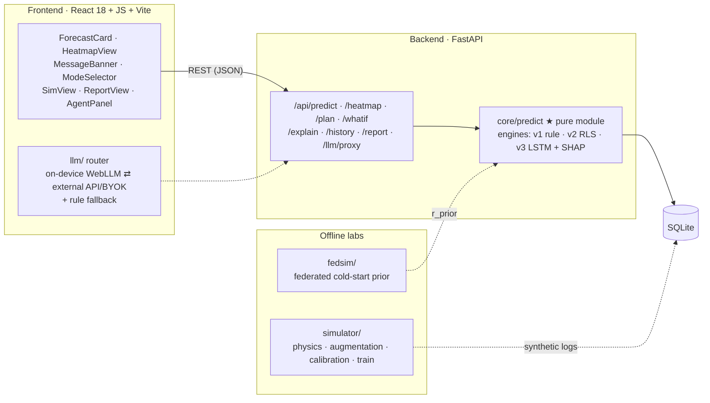

<div align="center">

# 🔋⛅ RoboVac Battery Forecast

**로봇청소기 배터리를 일기예보처럼 — "예상 사용 가능 시간 + 완료 확률"**


</div>

---

## What is this?

물리 기반 배터리 모델을 탑재한 청소 시뮬레이터가 센서·세션 로그를 합성하고, 예측 모델이 예상 사용 가능 시간 + 완료 확률을 산출한다. 예측 모델은 설계상 온라인(지속 학습형)이며, 콜드 스타트 문제는 연합 학습으로 개선한다.

## Architecture



## Repository layout

```
.
├── frontend/              # React 18 + JS + Vite — mobile-first forecast UI (360–420 px)
│   └── src/
│       ├── components/    #   ForecastCard · HeatmapView · MessageBanner · ModeSelector · …
│       ├── views/         #   SimView (2.5D replay) · ReportView · SettingsView
│       ├── llm/           #   provider router · numeric guardrail · template fallback
│       ├── agent/         #   "agent proposes, rules decide" dual-mode loop
│       ├── api/           #   REST client
│       └── storage/       #   next_plan adapter (server | localStorage)
├── backend/               # FastAPI thin server (Python 3.11)
│   └── app/
│       ├── api/           #   REST routers
│       ├── core/predict/  #   ★ pure prediction core — engines v1/v2/v3 + SHAP
│       ├── db/            #   SQLAlchemy models (SQLite)
│       └── llm/           #   /api/llm/proxy internals (token auth · whitelist · rate limit)
├── simulator/             # 🔬 offline lab — physics battery model · augmentation · calibration
│   └── train/             #   v3 quantile-LSTM training (PyTorch — never in the deploy bundle)
├── fedsim/                # 🔬 offline lab — federated-learning cold-start prior (3-arm experiment)
├── eval/                  # eval-500 · CI quick-100 · reliability diagram · ablation table
├── data/                  # seed maps · calibration outputs · demo.db (M0) · datasets (gitignored)
├── tests/                 # pytest suite + golden files
└── .github/workflows/     # CI PR gate · nightly eval · weekly labs · manual LLM eval
```

## Getting started

```sh
make setup   # once: Python 3.11 venv + deps, frontend npm install
make demo    # seed DB → FastAPI :8000 → Vite :5173
```

Also useful: `make test`, `make eval` (quick-100 metrics), `make lint`, `make golden`.

## Roadmap
- [x] **M0 — Core pipeline** · simulator v0, 60-session seed history, segment → base×drift → joint bootstrap, ForecastCard UI, CI gate + Vercel deploy live *(code complete — CI/Vercel gates activate on first push/import)*
- [ ] **M1 — Spatial layer** *(demo minimum)* · zone planner, trajectory heatmap, 부족A flow, next_plan carry-over
- [ ] **M2 — Physics & evaluation** · aging/voltage/temperature channels, NASA·UNIBO calibration, eval-500 + reliability diagram + ablation
- [ ] **M3 — LLM layer** · provider router (on-device ⇄ API ⇄ rules), guarded narration, dual-mode agent
- [ ] **M4 — Learning engines & XAI** · v2 RLS + v3 LSTM behind a 5-condition promotion gate, SHAP `/explain`, "예보가 빗나간 날" demo
- [ ] **M5 — Extended research & full demo** · fedsim 3-arm, agent workflows (history Q&A · diagnosis · weekly plan), SimView 2.5D
- [ ] **M6 — Native app** · PWA + Capacitor wrap (Android first)

## Quality gates

| Gate | Target |
|---|---|
| Time MAE (eval-500, holdout maps included) | ≤ 2.0 min |
| 90 % interval coverage | 86–94 % |
| Narration numeric-guardrail pass rate | ≥ 99 % |
| Agent constraint satisfaction / valid tool calls | ≥ 90 % / ≥ 98 % |
| Rule-fallback-only task success (no LLM) | ≥ 80 % |
| SHAP sign consistency vs physics | ≥ 95 % |

## Development conventions

- `main` is protected — work on `feat/*` branches; PRs need **1 reviewer**.
- Commit prefixes: `feat:` `fix:` `docs:` `test:` `sim:`
- Lint: **ruff + black** (Python) · **eslint + prettier** (JavaScript). No magic numbers — constants live in `config.py` with citations.
- The seed-fixed demo DB is committed; CI re-runs `simulate --seed 42` and asserts hash equality.

## Deployment profiles

| Profile | Target | Notes |
|---|---|---|
| **L** — local | dev & rehearsal | `make demo`, works fully offline |
| **W** — Vercel mobile web *(default)* | mentor review · always-on demo URL | static frontend + FastAPI as a Python serverless function; read-only seed DB; `/api/simulate` disabled |
| **A** — native app *(M6)* | final presentation | PWA → Capacitor, Android first; store submission out of scope |